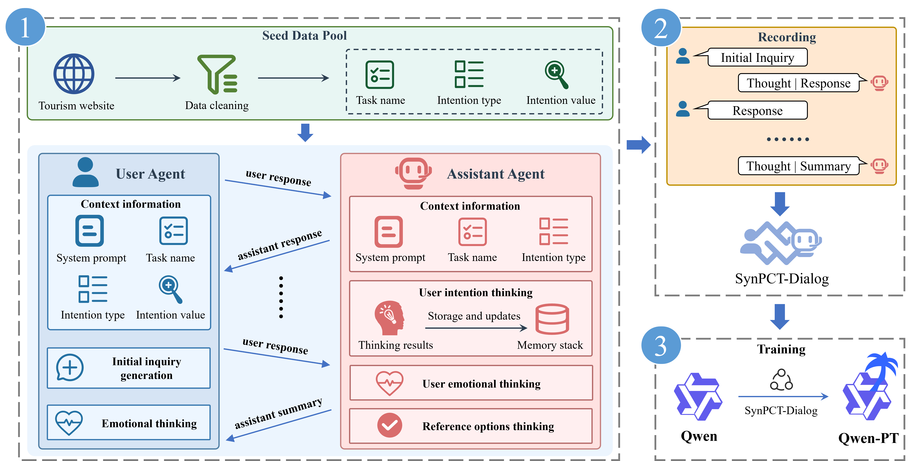

# 📄 SynPCT (An Improved Data Synthesis Method Driven by Large Language Models for Proactively Mining Implicit User Intentions in the Chinese Tourism Domain)

## 📝 Overview

This repository contains the official implementation of the paper **"An Improved Data Synthesis Method Driven by Large Language Models for Proactively Mining Implicit User Intentions in the Chinese Tourism Domain"**.  

### 🔍 Method
<p align="center">
  
</p>
Overview of SynPCT Methodology and Downstream Processing. It comprises four components: the seed data pool, the user agent, the assistant agent, and the recording component. The recording component collects dialogue data generated by interactions between the user agent and the assistant agent, forming a multi-turn dialogue dataset capable of proactively mine user implicit intention. The Qwen model is subsequently fine-tuned on this dataset, resulting in Qwen-PCT.

---

## 📁 Repository Structure

```bash
.
├── case_studies/       # Example
├── data/               # Seed data and synthesis data (results)
├── train_data/         # Training set
├── assistant_agent.py  # Implementation of Assistant Agent
├── user.py             # Implementation of User Agent
├── config.yaml         # Configuration file for seed data
├── utils.py            # Implementation of various tools
├── prompt.py           # Prompt
├── synthesis_data_to_train_data.py  # Converting synthetic data into training data
└── main.py             # Main execution file
```

## 🚀 Getting Started
### 1. Clone the Repository
```bash
git clone https://github.com/jqwangai/SynPCT.git
cd SynPCT
```

### 2. Install Dependencies
```bash
pip install openai
```

### 3. Prepare the seed data and config.yaml file.
- Make sure the keys of the seed data correspond to the information in config.yaml.

### 4. Run the main.py file
```bash
python main.py
```
Note the modification of the parameters in the code file.

### 5. Converting synthetic data into training data
```bash
python synthesis_data_to_train_data.py
```
Note the modification of the parameters in the code file.

## 📊 Data sets and model weights
- SynPCT-Dialog can be found in the file [`train_data/SynPCT-Dialog.json`](./train_data/SynPCT-Dialog.json)
- Qwen-PCT's LoRA weights can be found in this folder [`lora/`](./lora).
  
## 📷 Case Studies
**7.1 Executing user intentions**
- Document [`case_studies/7_1_1.md`](./case_studies/7_1_1.md) shows examples of Qwen-PCT's execution of user intentions.
- Document [`case_studies/7_1_2.md`](./case_studies/7_1_2.md) shows examples of larger language models that execute user intentions.

**7.2 An Agent workflow**
- Document [`case_studies/7_2.md`](./case_studies/7_2.md) presents sample output from the designed Agent workflow.
  
**7.3 Compatibility of other tasks**
- Document [`case_studies/7_3.md`](./case_studies/7_3.md) displays sample output from Qwen-PCT for other tasks.

**Example of initial inquiry**
- Document [`case_studies/example_of_initial_inquiry.xlsx`](./case_studies/example_of_initial_inquiry.xlsx) shows example output from Table 2 in the paper.

## 🔁 Detailed explanation of seed data.
|     Task Name                           	|     Intent Type                                    	|     Description of Intent Type                                                                                                   	| Quantities 	|
|-----------------------------------------	|----------------------------------------------------	|----------------------------------------------------------------------------------------------------------------------------------	|------------	|
|     Travel Plan                         	|     Destination                                    	|     The city involved in the travel plan.                                                                                        	| 290        	|
|                                         	|     Duration                                       	|     The total number of days the travel plan spans.                                                                              	|            	|
|                                         	|     Time                                           	|     The month or season during which the travel takes place.                                                                     	|            	|
|                                         	|     Per Capita Budget                              	|     The estimated expenditure per traveler.                                                                                      	|            	|
|                                         	|     Companions                                     	| The category of travel companions, such as friends, family members, or couples.                                                  	|            	|
|                                         	|     Travel Style                                   	|     The theme or mode of travel experience, for instance, independent travel, in-depth exploration, or photographic journeys.    	|            	|
|     Attraction Recommendation           	|     Destination                                    	|                                  The city in which the attraction is located.                                                    	| 200        	|
|                                         	|     Location                                       	| The commercial district or specific area within the city.                                                                        	|            	|
|                                         	|     Attraction Type                                	| The type of attraction to be recommended, such as botanical gardens or natural scenic spots.                                     	|            	|
|     Restaurant Recommendation           	|     Destination                                    	|     The city in which the restaurant is situated.                                                                                	| 250        	|
|                                         	|     Location                                       	|     The specific area or district within the city, often associated with notable landmarks or attractions.                       	|            	|
|                                         	|     Cuisine Type                                   	|     The culinary style or category of the restaurant, for example, buffet dining or traditional Chinese cuisine.                 	|            	|
|                                         	|     Budget Level                                   	|     The anticipated level of dining expenditure, such as low-budget, mid-budget, or high-budget.                                 	|            	|
|     Accommodation Reservation           	|     Destination                                    	| The city where the accommodation is located.                                                                                     	| 254        	|
|                                         	|     Location                                       	|     The area or district within the city, typically near key attractions or   business centers.                                  	|            	|
|                                         	|   Check-in/Check-out Dates                         	|     The specific dates designated for arrival and departure.                                                                     	|            	|
|                                         	| Hotel Star Rating                                  	|     The classification of the accommodation based on star ratings (e.g.,   two-star, three-star, five-star).                     	|            	|
|                                         	|     Accommodation Type                             	|     The category of lodging, such as business hotels or guesthouses.                                                             	|            	|
|                                         	|     Room Type                                      	|     The type of room required, for example, twin room or double room.                                                            	|            	|
|     Shopping Venue Inquiry              	|     Destination                                    	|     The city in which the shopping venue is located.                                                                             	| 241        	|
|                                         	|     Location                                       	|     The commercial district or specific area within the city.                                                                    	|            	|
|                                         	|     Shopping Type                                  	|     The category of the shopping venue, such as an eyewear store or a   general shopping mall.                                   	|            	|
|     Train Ticket Reservation            	|     Departure                                      	|     This specifies the city from which the train journey starts.                                                                 	| 291        	|
|                                         	|     Destination                                    	|     This specifies the city where the train journey ends.                                                                        	|            	|
|                                         	|                                  Departure Date    	|     The specific date on which the train journey is scheduled.                                                                   	|            	|
|                                         	|     Departure Time Window                          	|     The preferred time interval for departure (e.g., morning, between 9:00   and 11:00).                                         	|            	|
|                                         	|                                  Train Type        	|     The classification of train service, such as conventional trains or   high-speed rail.                                       	|            	|
|                                         	|     Seat Type                                      	|     The type of seating selected, for example, hard seat or business seat.                                                       	|            	|


## 📚 Citation
If you find this work useful, please cite our paper:
```bibtex

```