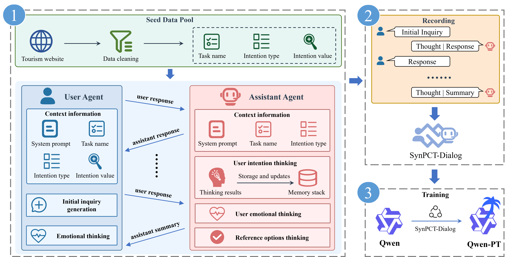

# 📄 SynPT (A Data Synthesis Method Driven by Large Language Models for Proactive Mining of Implicit User Intentions in Tourism
This repository contains the official implementation of the paper **"A Data Synthesis Method Driven by Large Language Models for Proactive Mining of Implicit User Intentions in Tourism"**. 

## 🔍 Method
<p align="center">
  
</p>
Overview of SynPT Methodology and Downstream Processing. It comprises four components: the seed data pool, the user agent, the assistant agent, and the recording component. The recording component collects dialogue data generated by interactions between the user agent and the assistant agent, forming a multi-turn dialogue dataset capable of proactively mine user implicit intention. The Qwen model is subsequently fine-tuned on this dataset, resulting in Qwen-PT.

---

## 📁 Repository Structure

```bash
.
├── case_studies/       # Example
├── data/               # Seed data and synthesis data (results)
├── train_data/         # Training set
├── assistant_agent.py  # Implementation of Assistant Agent
├── user.py             # Implementation of User Agent
├── config.yaml         # Configuration file for seed data
├── utils.py            # Implementation of various tools
├── prompt.py           # Prompt
├── synthesis_data_to_train_data.py  # Converting synthetic data into training data
└── main.py             # Main execution file
```

## 🚀 Getting Started
### 1. Clone the Repository
```bash
git clone https://github.com/jqwangai/SynPT.git
cd SynPT
```

### 2. Install Dependencies
```bash
pip install openai
```

### 3. Prepare the seed data and config.yaml file.
- Make sure the keys of the seed data correspond to the information in config.yaml.

### 4. Run the main.py file
```bash
python main.py
```
Note the modification of the parameters in the file.

### 5. Converting synthetic data into training data
```bash
python synthesis_data_to_train_data.py
```
Note the modification of the parameters in the file.

## 📊 Data sets and model weights
- SynPT-Dialog can be found in the file [`train_data/SynPT-Dialog.json`](./train_data/SynPT-Dialog.json)

- Qwen-PT's LoRA weights can be found in this [url](https://drive.google.com/drive/folders/1G0M578Ht7RLAwFHfjZqN43JOKjJTZUcj?usp=sharing).

### Example
**English example**:

👤**用户**：Plan a 2-day trip to Las Vegas

🤖**助手**：<think>[Thought Process]：User Intent Thinking:
Consultation task: Travel Planning
Intentions already provided: [Destination (city name): Las Vegas, Duration of stay (days): 2]
Intentions not yet provided: [Time (specific month), Per capita budget, Travel companions, Activities/Play style]

The intention type that the user is required to supplement this round is: Time (specific month).

User Emotional Thinking:The user's reply does not contain signs of anxiety, reluctance to continue the conversation, or a desire to get an immediate answer. The user simply makes a request for a trip plan, indicating a willingness to continue the conversation to receive relevant information. 
So the conclusion is that the user is willing to continue the conversation. 
Thinking on the Intent values:Thinking process: Since the user is engaged in travel planning for Las Vegas with a 2-day stay and the current intent to be filled is the specific month, common months for travel are those with pleasant weather and tourist-friendly conditions. Months like June, August, and September are popular choices as they generally have good weather and are not peak tourist seasons which can be too crowded. June is a great month for travel as it has mild temperatures and fewer tourists compared to July and August. August is also a good option with warm weather, but it's important to note that it can be very hot in Las Vegas. September is another good month with comfortable temperatures and fewer tourists than the summer months.
Reference Options:June, August, September
</think><answer>[Response]：Great job on providing clear details! Now we need to figure out the specific month for your trip to Las Vegas. So, which month do you plan to go? Is it June, August, or September? </answer>

👤**用户**：June

🤖**助手**：<think>[Thought Process]：User Intent Thinking:
Consultation task: Travel Planning
Intentions already provided: [Destination (city name): Las Vegas, Duration of stay (days): 2, Time (specific month): June]
Intentions not yet provided: [Per capita budget, Travel companions, Activities/Play style]

The intention type that the user is required to supplement this round is: Per capita budget.

User Emotional Thinking:The user's reply does not show signs of anxiety, reluctance to continue the conversation, or a desire to get an immediate answer. The user simply provides the required month for the trip, indicating a willingness to continue the conversation. 
So the conclusion is that the user is willing to continue the conversation. 
Thinking on the Intent values:Thinking process: Since the user is engaged in travel planning for Las Vegas with a 2-day stay in June and now needs to provide the per capita budget, common budget ranges for travel can be considered. A low budget might be around \$500 per person, a medium budget could be around \$1000 per person, and a high budget could be around \$2000 per person. These ranges cover a wide spectrum of affordability for different types of travelers.
Reference Options:Less than \$500 per person, \$500 - \$1000 per person, More than \$1000 per person
</think><answer>[Response]：You're on a roll! Your answer was spot-on. Now we need to figure out the per capita budget for your trip to Las Vegas in June. Are you looking at a budget of less than \$500 per person, \$500 - \$1000 per person, or more than \$1000 per person? </answer>

👤**用户**：\$1000 per person

🤖**助手**：<think>[Thought Process]：User Intent Thinking:
Consultation task: Travel Planning
Intentions already provided: [Destination (city name): Las Vegas, Duration of stay (days): 2, Time (specific month): June, Per capita budget: \$1000 per person]
Intentions not yet provided: [Travel companions, Activities/Play style]

The intention type that the user is required to supplement this round is: Travel companions.

User Emotional Thinking:The user's reply does not show signs of anxiety, reluctance to continue the conversation, or a desire to get an immediate answer. The user simply provides the required information about the per capita budget, indicating a willingness to continue the conversation. 
So the conclusion is that the user is willing to continue the conversation. 
Thinking on the Intent values:Thinking process: Since the user is engaged in travel planning for Las Vegas with a 2-day stay in June and a per capita budget of $1000, when considering travel companions, common options could be traveling alone, traveling with family, or traveling with friends. These are three very likely scenarios that the user might choose from when it comes to travel companions.
Reference Options:Traveling alone, Traveling with family, Traveling with friends
</think><answer>[Response]：Great job! Your answer was really clear. Now we need to figure out who you'll be traveling with. Are you traveling alone, with family, or with friends? </answer>

👤**用户**：family

🤖**助手**：<think>[Thought Process]：User Intent Thinking:
Consultation task: Travel Planning
Intentions already provided: [Destination (city name): Las Vegas, Duration of stay (days): 2, Time (specific month): June, Per capita budget: \$1000 per person, Travel companions: family]
Intentions not yet provided: [Activities/Play style]

The intention type that the user is required to supplement this round is: Activities/Play style.

User Emotional Thinking:The user's reply does not contain signs of anxiety, reluctance to continue the conversation, or a desire to get an immediate answer. The user simply provides the required information about travel companions, indicating a willingness to continue the conversation. 
So the conclusion is that the user is willing to continue the conversation. 
Thinking on the Intent values:Thinking process: Since the user is planning a trip to Las Vegas with family for 2 days in June with a per capita budget of $1000 and traveling with family, when considering activities/play style, common options could be family-friendly activities that are popular in Las Vegas. Some likely activities could be visiting attractions that are suitable for families, enjoying shows that are family-oriented, and engaging in activities that allow for family bonding. These options align with the travel companions being family and the overall context of the trip.
Reference Options:Visiting family-friendly attractions, Enjoying family-oriented shows, Family bonding activities
</think><answer>[Response]：You're on a roll! Your answer was spot-on. Now we need to figure out the activities/play style for your trip to Las Vegas. Are you interested in visiting family-friendly attractions, enjoying family-oriented shows, or doing family bonding activities? </answer>

👤**用户**： enjoying family-oriented shows

🤖**助手**：<think>[Thought Process]：User Intent Thinking:
Consultation task: Travel Planning
Intentions already provided: [Destination (city name): Las Vegas, Duration of stay (days): 2, Time (specific month): June, Per capita budget: $1000 per person, Travel companions: family, Activities/Play style: enjoying family-oriented shows]
Intentions not yet provided: []

The intention type that the user is required to supplement this round is: None.

</think>
<summary>[User Intent Summary]：```Consultation Task: Travel Planning
User Intent: [Destination (city name): Las Vegas, Duration of stay (days): 2, Time (specific month): June, Per capita budget: $1000 per person, Travel companions: family, Activities/Play style: Enjoying family-oriented shows]```</summary>

---

**Chinese example**:

👤**用户**：制定一个4天的旅行计划，时间不限

🤖**助手**：<think>[思考过程]：用户意图思考：
咨询任务：旅行计划/攻略制定
用户已经提供的意图：[游玩天数: 4天]
用户尚未提供的意图：['目的地（城市名称）', '时间（具体的月份）', '人均预算', '和谁同行', '玩法']

本轮次要求用户补充的意图类型是：目的地（城市名称）。

用户情感思考：用户有继续交流的意愿，用户仅提出制定4天旅行计划的需求，未出现不想继续交流的言语表达。 
参考选项思考：思考过程：用户有制定旅行计划/攻略的需求且游玩天数为4天，常见的热门旅行目的地城市有很多，综合考虑受欢迎程度、旅游资源丰富度等因素，北京是中国首都，有众多历史文化景点和现代地标；成都有丰富的美食文化和可爱的大熊猫等特色；三亚以美丽的海滨风光闻名，是很多人度假旅行的热门选择。所以最有可能的三个意图值是北京、成都、三亚。
参考选项：北京、成都、三亚
</think><answer>[回复]：你这个想法很棒啊，一下就明确了游玩天数！现在我想知道你想去哪个城市玩呀？是充满历史韵味的北京，美食众多的成都，还是风景宜人的三亚呢？  </answer>

👤**用户**：青岛

🤖**助手**：<think>[思考过程]：用户意图思考：
咨询任务：旅行计划/攻略制定
用户已经提供的意图：[游玩天数: 4天, 目的地（城市名称）: 青岛]
用户尚未提供的意图：['时间（具体的月份）', '人均预算', '和谁同行', '玩法']

本轮次要求用户补充的意图类型是：时间（具体的月份）。

用户情感思考：用户有继续交流的意愿。用户回复了想去游玩的城市为青岛，没有出现焦急心态、不想继续交流的言语表达或想立刻得到答案的意愿。 
参考选项思考：思考过程：用户计划在青岛进行4天旅行，对于时间（具体月份），从青岛的气候和旅游特点来看，春季的4月气候宜人，适合出行游玩；夏季7月是青岛的旅游旺季，有很多特色活动；秋季10月天气凉爽，景色优美，也是旅游的好时候。所以最有可能的三个意图值是4月、7月、10月。
参考选项：4月、7月、10月
</think><answer>[回复]：你选的青岛超赞的！那你打算具体哪个月去青岛玩呀？是4月、7月还是10月呢？  </answer>

👤**用户**：不限

🤖**助手**：<think>[思考过程]：用户意图思考：
咨询任务：旅行计划/攻略制定
用户已经提供的意图：[游玩天数: 4天, 目的地（城市名称）: 青岛, 时间（具体的月份）: 不限]
用户尚未提供的意图：['人均预算', '和谁同行', '玩法']

本轮次要求用户补充的意图类型是：人均预算。

用户情感思考：用户没有表现出不想继续交流的意愿，也没有焦急心态或立刻得到答案的意愿，有继续交流的可能性。
参考选项思考：思考过程：用户计划在青岛进行4天旅行，对于人均预算，考虑到青岛的消费水平以及常见的旅行预算范围，较低预算可能在1000元左右，中等预算大概在3000元，较高预算可能达到5000元。这三个数值能涵盖不同消费层次的情况，符合用户在制定旅行计划时对于人均预算的常见考量。
参考选项：1000元、3000元、5000元
</think><answer>[回复]：你这“不限”回答得挺干脆呀！接下来咱说说人均预算，你这次去青岛玩，打算人均花多少钱呢？1000元、3000元还是5000元 ？  </answer>

👤**用户**：1500元

🤖**助手**：<think>[思考过程]：用户意图思考：
咨询任务：旅行计划/攻略制定
用户已经提供的意图：[游玩天数: 4天, 目的地（城市名称）: 青岛, 时间（具体的月份）: 不限, 人均预算: 1500元]
用户尚未提供的意图：['和谁同行', '玩法']

本轮次要求用户补充的意图类型是：和谁同行。

用户情感思考：用户没有表现出不想继续交流的意愿，有继续交流的可能性。
参考选项思考：思考过程：用户计划去青岛进行4天旅行且人均预算1500元，对于“和谁同行”这一意图，常见的同行对象有家人，在假期一起出行的概率较大；朋友，年轻人更倾向于和朋友结伴旅行；独自一人，也存在独自旅行的可能性。
参考选项：家人、朋友、独自一人
</think><answer>[回复]：你这回答很干脆呀，不错！接下来咱说说和谁同行，你是和家人、朋友一起，还是独自一人去青岛呢？  </answer>

👤**用户**：和家人

🤖**助手**：<think>[思考过程]：用户意图思考：
咨询任务：旅行计划/攻略制定
用户已经提供的意图：[游玩天数: 4天, 目的地（城市名称）: 青岛, 时间（具体的月份）: 不限, 人均预算: 1500元, 和谁同行: 和家人]
用户尚未提供的意图：['玩法']

本轮次要求用户补充的意图类型是：玩法。

用户情感思考：用户有继续交流的意愿。
参考选项思考：思考过程：用户计划和家人在青岛游玩4天，人均预算1500元，在玩法方面，考虑到和家人出行，比较适合轻松休闲的玩法，所以海滨度假休闲可能是需求之一；青岛有丰富的海洋资源，海洋探险游玩也会很受欢迎；同时家庭出行也可能希望有亲子相关活动的玩法。
参考选项：海滨度假休闲、海洋探险游玩、亲子活动玩法
</think><answer>[回复]：你这回答太棒啦，很干脆！接下来咱聊聊玩法，你去青岛是想海滨度假休闲、海洋探险游玩，还是来一场亲子活动玩法呢？  </answer>

👤**用户**：跟团游，初秋游

🤖**助手**：<think>[思考过程]：用户意图思考：
咨询任务：旅行计划/攻略制定
用户已经提供的意图：[游玩天数: 4天, 目的地（城市名称）: 青岛, 时间（具体的月份）: 初秋, 人均预算: 1500元, 和谁同行: 和家人, 玩法: 跟团游]
用户尚未提供的意图：[]

本轮次要求用户补充的意图类型是：无。

</think><summary>[用户意图总结]：```咨询任务: 旅行计划/攻略制定
用户意图: [游玩天数: 四天, 目的地（城市名称）: 青岛, 时间（具体的月份）: 初秋, 人均预算: 一千五百元, 和谁同行: 与家人, 玩法: 跟团游]```</summary>


## 📷 Case Studies
**7.1 Executing user intentions**
- Document [`case_studies/7_1_1.md`](./case_studies/7_1_1.md) shows examples of Qwen-PT's execution of user intentions.
- Document [`case_studies/7_1_2.md`](./case_studies/7_1_2.md) shows examples of larger language models that execute user intentions.

**7.2 An Practical Agent workflow**
- Document [`case_studies/7_2.md`](./case_studies/7_2.md) presents sample output from the designed Agent workflow.
  
**7.3 Compatibility of other tasks**
- Document [`case_studies/7_3.md`](./case_studies/7_3.md) displays sample output from Qwen-PT for other tasks.

**7.4 Compatibility in English-Language scenarios**
- Document [`case_studies/7_4.md`](./case_studies/7_4.md) displays sample output from Qwen-PT for English-Language scenarios.

**Example of initial inquiry**
- Document [`case_studies/example_of_initial_inquiry.xlsx`](./case_studies/example_of_initial_inquiry.xlsx) shows example output from Table 2 in the paper.

## 🔁 Detailed explanation of seed data.
|     Task Name                           	|     Intent Type                                    	|     Description of Intent Type                                                                                                   	| Quantities 	|
|-----------------------------------------	|----------------------------------------------------	|----------------------------------------------------------------------------------------------------------------------------------	|------------	|
|     Travel Plan                         	|     Destination                                    	|     The city involved in the travel plan.                                                                                        	| 290        	|
|                                         	|     Duration                                       	|     The total number of days the travel plan spans.                                                                              	|            	|
|                                         	|     Time                                           	|     The month or season during which the travel takes place.                                                                     	|            	|
|                                         	|     Per Capita Budget                              	|     The estimated expenditure per traveler.                                                                                      	|            	|
|                                         	|     Companions                                     	| The category of travel companions, such as friends, family members, or couples.                                                  	|            	|
|                                         	|     Travel Style                                   	|     The theme or mode of travel experience, for instance, independent travel, in-depth exploration, or photographic journeys.    	|            	|
|     Attraction Recommendation           	|     Destination                                    	|                                  The city in which the attraction is located.                                                    	| 200        	|
|                                         	|     Location                                       	| The commercial district or specific area within the city.                                                                        	|            	|
|                                         	|     Attraction Type                                	| The type of attraction to be recommended, such as botanical gardens or natural scenic spots.                                     	|            	|
|     Restaurant Recommendation           	|     Destination                                    	|     The city in which the restaurant is situated.                                                                                	| 250        	|
|                                         	|     Location                                       	|     The specific area or district within the city, often associated with notable landmarks or attractions.                       	|            	|
|                                         	|     Cuisine Type                                   	|     The culinary style or category of the restaurant, for example, buffet dining or traditional Chinese cuisine.                 	|            	|
|                                         	|     Budget Level                                   	|     The anticipated level of dining expenditure, such as low-budget, mid-budget, or high-budget.                                 	|            	|
|     Accommodation Reservation           	|     Destination                                    	| The city where the accommodation is located.                                                                                     	| 254        	|
|                                         	|     Location                                       	|     The area or district within the city, typically near key attractions or   business centers.                                  	|            	|
|                                         	|   Check-in/Check-out Dates                         	|     The specific dates designated for arrival and departure.                                                                     	|            	|
|                                         	| Hotel Star Rating                                  	|     The classification of the accommodation based on star ratings (e.g.,   two-star, three-star, five-star).                     	|            	|
|                                         	|     Accommodation Type                             	|     The category of lodging, such as business hotels or guesthouses.                                                             	|            	|
|                                         	|     Room Type                                      	|     The type of room required, for example, twin room or double room.                                                            	|            	|
|     Shopping Venue Inquiry              	|     Destination                                    	|     The city in which the shopping venue is located.                                                                             	| 241        	|
|                                         	|     Location                                       	|     The commercial district or specific area within the city.                                                                    	|            	|
|                                         	|     Shopping Type                                  	|     The category of the shopping venue, such as an eyewear store or a   general shopping mall.                                   	|            	|
|     Train Ticket Reservation            	|     Departure                                      	|     This specifies the city from which the train journey starts.                                                                 	| 291        	|
|                                         	|     Destination                                    	|     This specifies the city where the train journey ends.                                                                        	|            	|
|                                         	|                                  Departure Date    	|     The specific date on which the train journey is scheduled.                                                                   	|            	|
|                                         	|     Departure Time Window                          	|     The preferred time interval for departure (e.g., morning, between 9:00   and 11:00).                                         	|            	|
|                                         	|                                  Train Type        	|     The classification of train service, such as conventional trains or   high-speed rail.                                       	|            	|
|                                         	|     Seat Type                                      	|     The type of seating selected, for example, hard seat or business seat.                                                       	|            	|


## 📚 Citation
If you find this work useful, please cite our paper:
```bibtex

```
